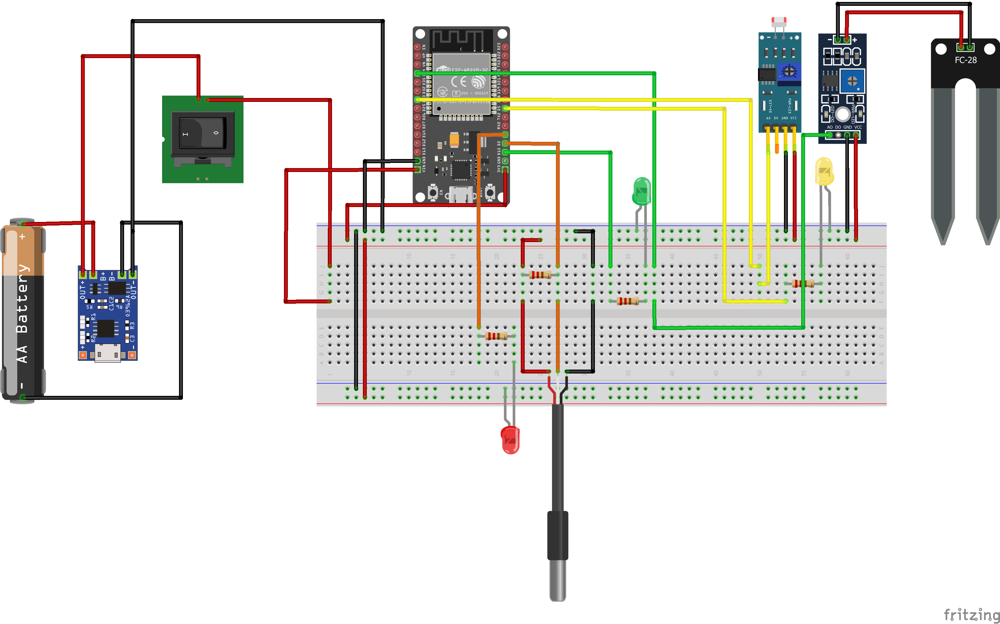
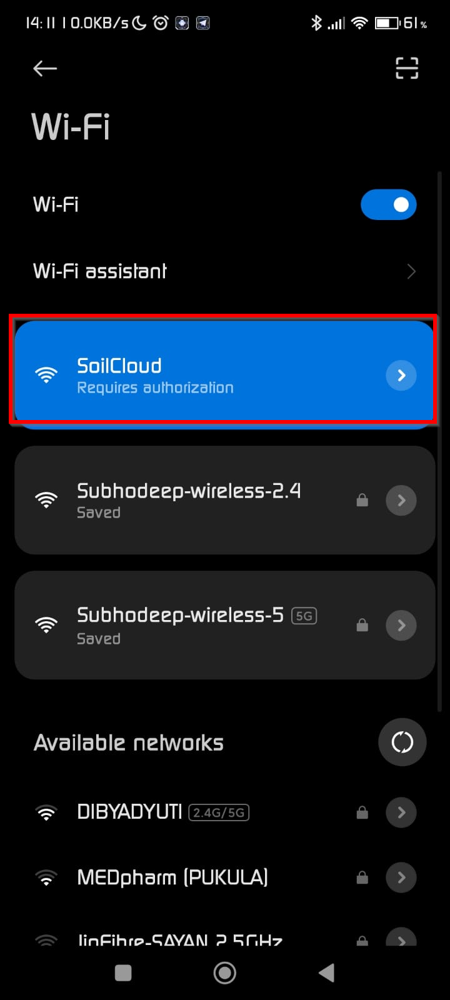
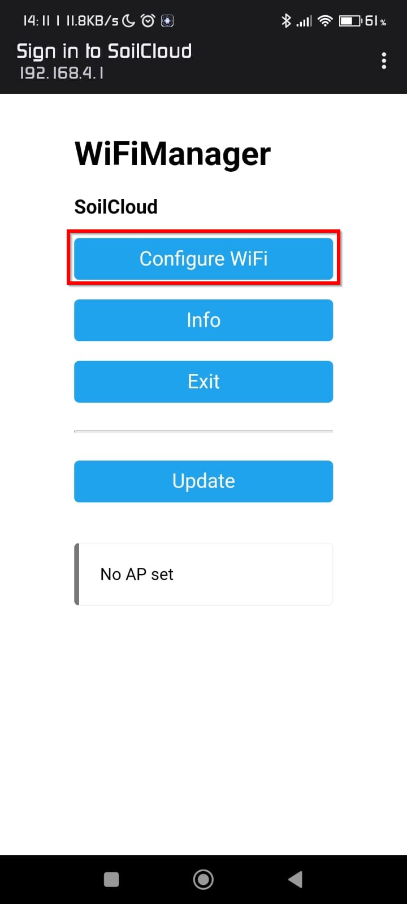
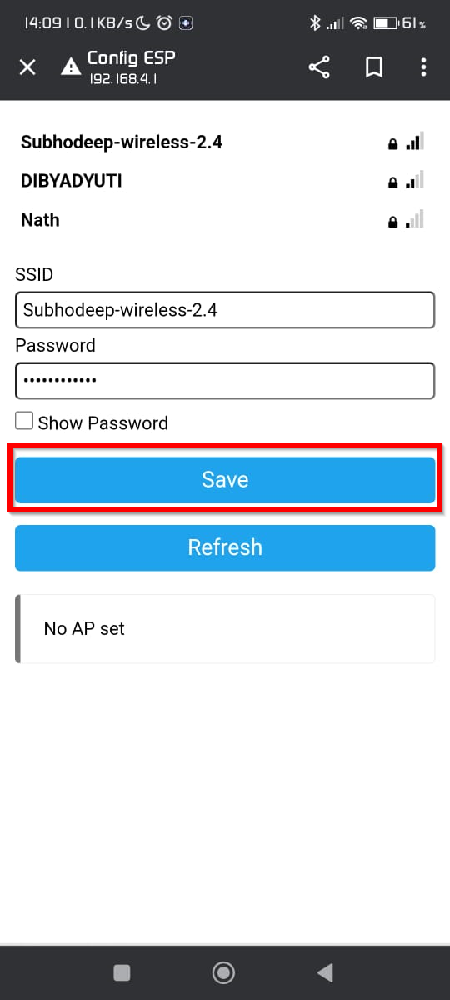
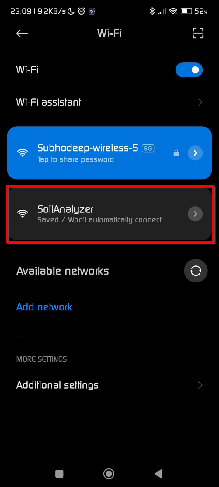
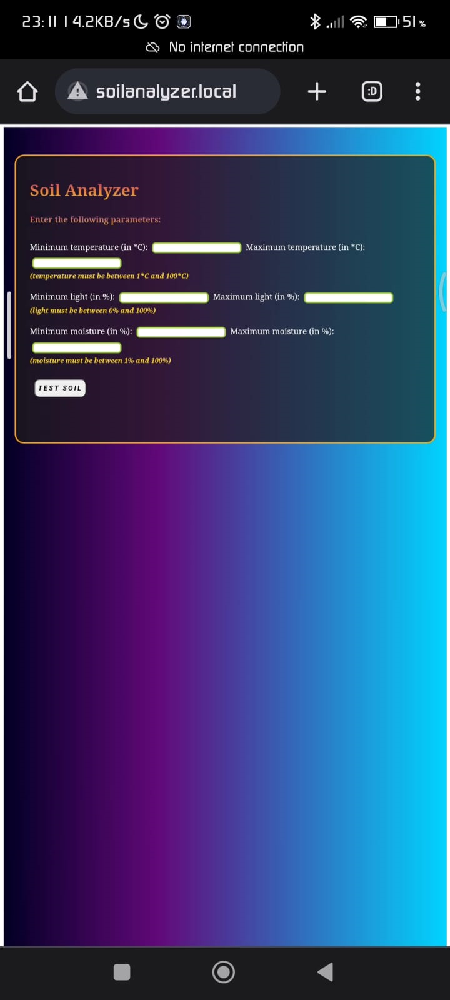
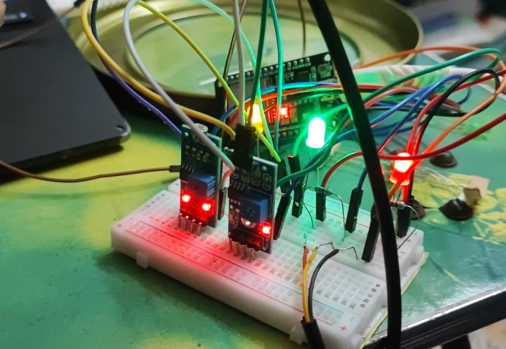
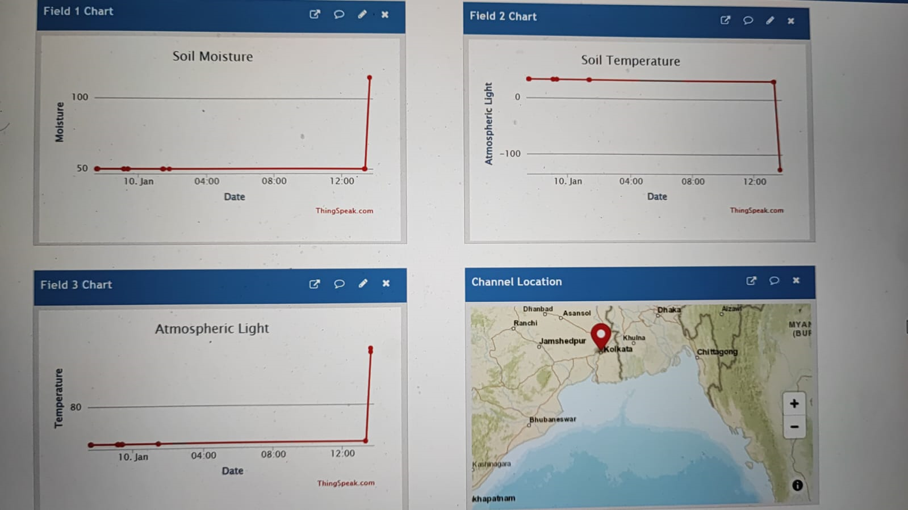
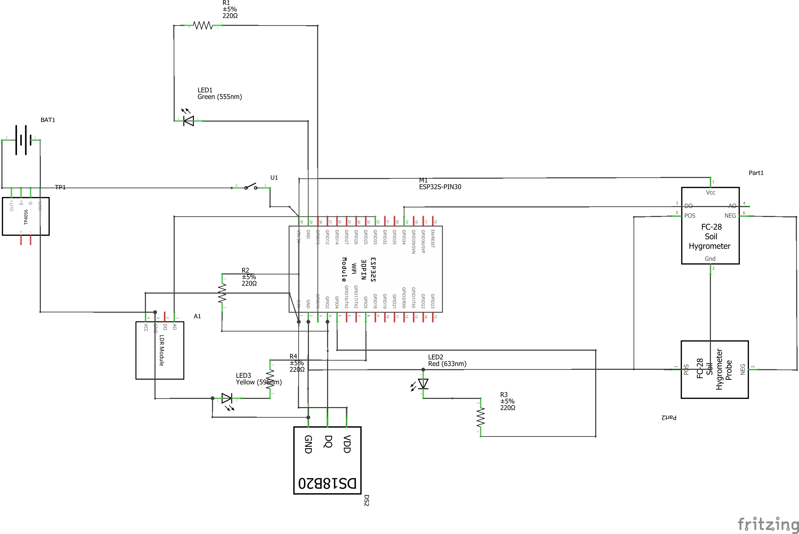

# SoilAnalyzer
#### IoT device for real-time soil analysis and monitoring

*Final Semester Major Project for the completion award of PG Degree 'Master of Computer Application' 2023*
****
***<a href="resources/Final_year_report.pdf">Download Documentation</a>***

## Group Members
| Name | University Roll | Github username |
|------|-----------------|-----------------|
|Subhodeep Sarkar|29171021011|<a href='https://github.com/H4CK3RD33P'>H4CK3RD33P</a>|
|Birupaksha Dey|29171021028|
|Soutik Mahanta|29171021036|
|Subhajyoti Mondal|29171021039|<a href='https://github.com/Subhajyoti007'>Subhajyoti007</a>|

## Mentor
❤️ ***Prof. Piyali Mukherjee***

## Special Thanks
❤️ ***Prof. Biplab Chowdhury***  
❤️ ***Prof. Tanmay De***  
❤️ ***Shubhadeep Maity***

*SoilAnalyzer is an IoT device based on ESP-32 which analyzes and monitors soil in real-time on Webpage and ThingSpeak via WebSockets.*

****
**Breadboard Diagram**

## Why do we need SoilAnalyzer?
In recent years farmers in India are falling prey to scams where they are sold plot of land which are not fit for agriculture of a particular crop.
 
The main reason of such happenings is because farmers are relying on mere instincts while purchasing land and not on data. This eventually leads to huge losses as the quantity of crops produced on unsuitable lands is significantly less and have reduced quality. Thus, farmers do not get the selling price that they deserve.
 
To help them overcome this problem, this device is created. The farmers can enter desired minimum and maximum soil moisture and atmospheric light in percentage and temperature in degree Celcius on a webpage after connecting to it via WiFi using smartphone. Now the device monitors the parameters and updates them in real-time over the page using WebSockets. The same data is also logged into ThingSpeak cloud.

## Dependencies
**Install these before compiling)**
- [AsyncTCP](https://github.com/me-no-dev/AsyncTCP)
- [ESPAsyncWebServer](https://github.com/me-no-dev/ESPAsyncWebServer) 
- ESPmDNS*
- Ticker*
- WiFi*
- [ArduinoJson](https://github.com/bblanchon/ArduinoJson)
- [WebSocketsServer](https://github.com/Links2004/arduinoWebSockets)
- [OneWire](https://github.com/PaulStoffregen/OneWire)
- [DallasTemperature](https://github.com/milesburton/Arduino-Temperature-Control-Library)
- [ESPAsyncWiFiManager](https://github.com/alanswx/ESPAsyncWiFiManager)
- [ThingSpeak](https://github.com/mathworks/thingspeak-arduino)
 
\*comes with ESP-32 board in Arduino IDE

## How it works?
**The WiFi mode of ESP-32 is set to AP_STP to allow the module to be in access point as well as station mode simultaneously.**
 
 
SoilCloud AP is started where a smart device is connected to access the configuration portal to connect the ESP-32 to an internet-enabled network. It then scans nearby available WiFi networks and displays them with their SSID and Signal strength and the user has to select one of them and enter the password to connect to that network.

Once the ESP-32 is connected to an internet-enabled network it closes SoilCloud AP.

Now it starts SoilAnalyzer AP where a user connects a smart device to access the input form via browser. IP is not required as the local mDNS server can convert the domain name to IP. The domain name is http://soilanalyzer.local/

User has to enter all the minimum and maximum values here.
Once the user enters all the desired parameters, data validation is done and upon success, it takes the user to another page (URL: http://soilanalyzer.local/results )

This is where the real-time data is matched against the user input and it shows whether the requirement has passed or not. If a particular parameter is passed the LED associated with it turns on.

This data is updated after every 17 seconds using WebSockets. The communication between frontend and server takes place using JSON via WebSockets and the same data is uploaded to the ThingSpeak server where it is plotted in graphs this data is further analyzed using MATLAB analysis tool built inside ThingSpeak

**Schematic Diagram**

